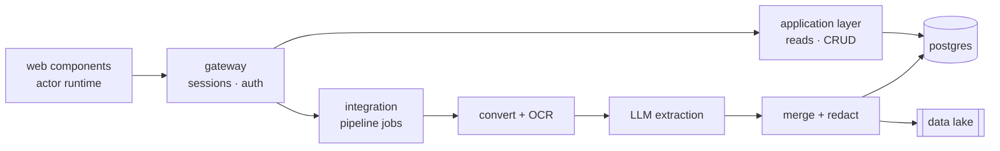

<div align="center">


<a href="https://niazsite.vercel.app"></a>

<samp><a href="https://niazsite.vercel.app"><b>portfolio</b></a> &nbsp;·&nbsp; <a href="https://www.linkedin.com/in/mohammed-niaz-ul/"><b>linkedin</b></a> &nbsp;·&nbsp; <a href="https://x.com/AsahiKibo1"><b>x</b></a> &nbsp;·&nbsp; <a href="https://github.com/Niaz-Ul-Haque?tab=repositories"><b>repositories</b></a></samp>

</div>

<br>

I build systems that take messy input — eighty-page financial PDFs, scanned faxes, three different spellings of the same client's name — and turn it into something a database is willing to accept.

Python where the ML libraries live, TypeScript nearly everywhere else, Postgres underneath, and an unreasonable share of my attention on the seams between services, because that is where things actually break. I would rather ship a system someone else can still run in two years than one that wins an argument about frameworks.

> [!NOTE]
> Twenty-four of my thirty most recent repositories are private. What follows is the trailer, not the film.

<br>

## What I'm actually building

Client names and product names omitted. The engineering was the interesting part anyway.

**A document intelligence platform.** Canadian financial-advisory documents in; complete, redacted client profiles out. A Python engine handles conversion, OCR, LLM extraction and profile merge. A Node gateway owns the public surface, sessions and CRUD. Postgres and a filesystem data lake hold the results. Every hop is HTTP. There is no message bus, because there did not need to be one.

**A strangler migration nobody noticed.** Four Python services moved to Node one frozen contract at a time, with the new process answering the old loopback ports so the document pipeline kept calling them without knowing anything had changed. The remaining blockers are written down in the repo, including the three places where two processes still share state through a filesystem instead of an API. Unwritten blockers have a way of becoming somebody's Tuesday.

**A frontend with no framework.** Native web components on an actor runtime: FIFO mailboxes, onion middleware, and a supervisor that health-checks its children and restarts the ones that stop answering. `fetch` lives in exactly one file. The model layer never touches the DOM. It was either principle or spite, and the bundle is smaller either way.

**An internal component library.** Custom elements, no runtime dependency, two stylesheets — the components and the theme values. It never goes to npm. Every product consumes it as an internal package, so a change to the look lands everywhere at once instead of in four pull requests.

**The rules repo.** One repository holding the code-design practices, git workflow, PR checklist and review tooling that every other repository points at instead of copying. I work with coding agents daily, and the hard file turns out not to be the code — it's the one that explains what "good" means here, precisely enough that something without taste can follow it.

<details>
<summary><b>&nbsp;the shape of it, roughly</b></summary>

<br>



One public port. Everything else on loopback. The data lake is disposable by design — every profile in Postgres can be rebuilt from its artifacts, so a bad extraction is a reprocess, never a re-ingest.

</details>

<br>

## On the public shelf

**[Revert Guide](https://github.com/Niaz-Ul-Haque/revert-guide)** — An offline-first, multilingual companion for new Muslims. English and French, structured content, automatic language fallback, and a translation layer built to take a third language without a rewrite.

**[ScrollMate](https://github.com/Niaz-Ul-Haque/Scrollmate)** — Hands-free auto-scroll for vertical comics on Android. Kotlin, accessibility gesture dispatch, a floating bubble that remembers where you put it, and deliberately **no `INTERNET` permission**. It cannot phone home. There is no phone, and there is no home.

**[Pocket Pilot](https://github.com/Niaz-Ul-Haque/pocket-pilot)** — Privacy-first personal finance for Canadians. Budgets, savings goals, cash-flow forecasting, anomaly detection, row-level security, and an assistant that reads your spending so you don't have to relive it.

**[AWS Backend Playground](https://github.com/Niaz-Ul-Haque/aws-backend-playground)** — Lambda, DynamoDB, SAM, Parameter Store, and a deploy pipeline that authenticates through OIDC instead of a long-lived access key sitting in a secret somebody forgot to rotate.

**[SN Pest Control](https://github.com/Niaz-Ul-Haque/sn-pest-nextjs)** — A bilingual production site, rebuilt. Statically generated, accessible, structured data throughout, and fast on the phone of someone who is currently looking at a wasp.

<br>

## Tools

<div align="center"></div>

And the unglamorous half that does the actual work: Vitest, Playwright, pgTAP, ruff, mypy, Docling, OCR, hermetic test suites that need no network, and a `commit-msg` hook that rejects my own commit messages more often than I would like to put in writing.

<br>

## Changelog

```console
## [2026.09] — unreleased

### Added
- a pipeline that reads eighty-page PDFs so that no human has to
- pre-push hooks running typecheck and tests, because I could not be trusted
- an architecture document, before the architecture

### Changed
- the frontend framework (removed it)
- "microservice" to "module", after counting the actual hops

### Deprecated
- "we'll clean this up later"

### Known issues
- still explains system architecture at dinner parties
- open tabs: 47 (wontfix)
```

<details>
<summary><b>&nbsp;numbers, for the people who like numbers</b></summary>

<br>

<div align="center"></div>

Weekends excluded on purpose. A streak that punishes you for having a Saturday is not a metric, it's a landlord.

</details>

<details>
<summary><b>&nbsp;off-duty</b></summary>

<br>

K-dramas, anime and K-pop, in roughly that order and occasionally all at once. I have opinions about the pacing of the back half of a sixteen-episode run and I will share them without being asked.

Otherwise: taking things apart to find out how they work, rebuilding them slightly worse, and learning more from the worse version than the original ever taught me.

</details>

<br>

<div align="center">

<picture><source media="(prefers-color-scheme: dark)" srcset="https://raw.githubusercontent.com/Niaz-Ul-Haque/Niaz-Ul-Haque/output/github-contribution-grid-snake-dark.svg"><source media="(prefers-color-scheme: light)" srcset="https://raw.githubusercontent.com/Niaz-Ul-Haque/Niaz-Ul-Haque/output/github-contribution-grid-snake.svg"></picture>

<br><br>

<samp><b>Build useful things. Write down why. Ship.</b></samp>

</div>


